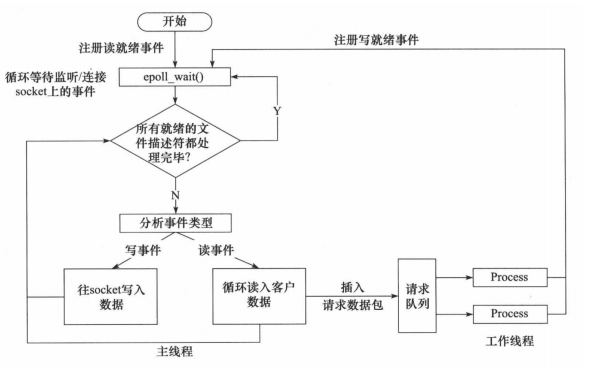

# C++实现的高并发服务器
## 主函数流程
1. 设置服务器端口
2. 设置SIGPIPE信号处理， 防止客户端断开连接导致服务器写入时进程终止
3. 初始化线程池
4. 设置监听socket（初始化，绑定，监听，接收）
5. 注册epoll对象，设置事件处理

## 服务器事件处理模式
### 模拟 Proactor 模式
使用同步 I/O 方式模拟出 Proactor 模式。原理是：主线程执行数据读写操作，读写完成之后，主线程向
工作线程通知这一”完成事件“。那么从工作线程的角度来看，它们就直接获得了数据读写的结果，接下
来要做的只是对读写的结果进行逻辑处理。
1. 主线程往epoll内核事件表中注册scoket上的读就绪事件
2. 线程调用epoll_wait等待socket上有数据可读
3. 当socket上有数据可读时，epoll_wait通知主线程；主线程从socket循环读取数据，直到没有更多数据可读，然后将读取到的数据封装成一个请求对象并插入请求队列
4. 睡眠在请求队列上的某个工作线程被唤醒，它获得请求对象，并处理客户请求，然后往epoll内核时间表中注册该socket上的写就绪事件
5. 主线程调用epoll_wait等待socket可写
6. 当socket可写时， epoll_wait通知主线程；主线程往socket上写入服务器处理客户请求的结果

## 线程池的实现
线程池包含一组线程和一个任务队列，用信号量对任务队列进行管理，队列的增加和线程去队列中取任务执行都需要使用互斥锁以保证同步。

## 主线程任务的具体实现
1. 创建具有最大连接数的users数组用于保存所有的http连接
2. 创建epoll对象和具有最大监听数的event事件数组
3. 将listenfd添加到epoll对象中进行监听
4. 对所有监听到的文件描述符进行处理
   1. 如果监听到到的文件描述符是listenfd，说明有新的客户端连接，建立sockaddr_in地址，使用accept接收新的连接，并将新socket的文件描述符加入epoll中监听
   2. 如果检测到读事件，读取数据后将http连接对象放入请求队列中
   3. 如果检测到写事件，将事件写回客户端

